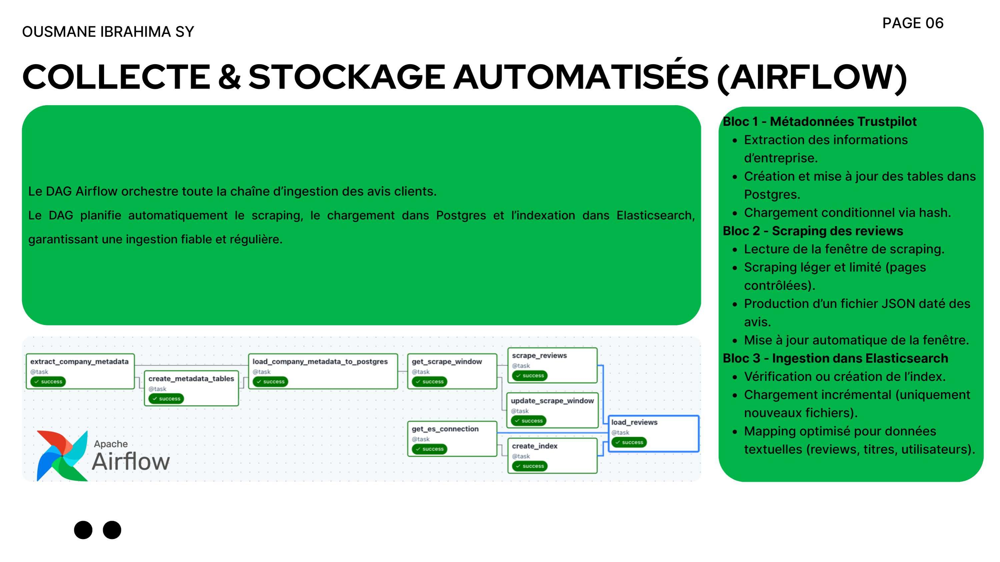
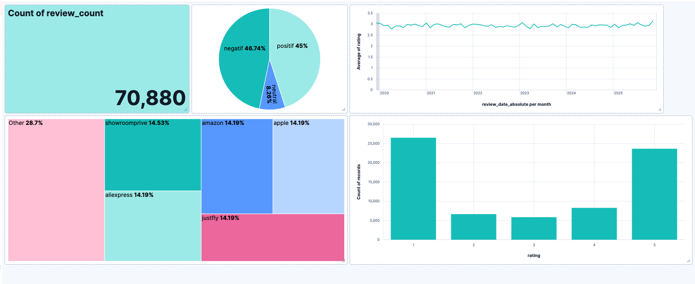
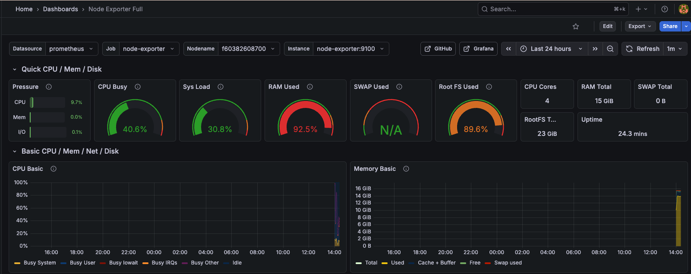
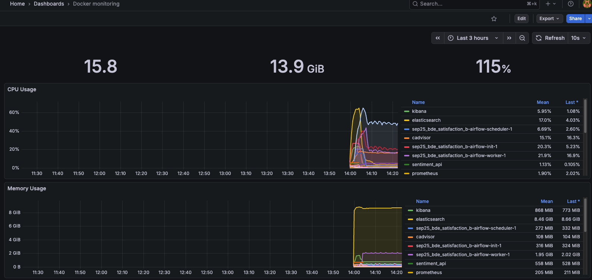

[](https://github.com/OusmaneiSY/prj_satisfaction_client/actions/workflows/ci.yml)

# Projet Satisfaction Client : Analyse automatisée des avis e-commerce

> Pipeline complet de collecte, traitement, classification et supervision des avis clients Trustpilot.  
> De la donnée brute à l'API de prédiction en production, 100% conteneurisé.

---

## 📌 Contexte & Objectif

Les entreprises e-commerce reçoivent chaque jour des milliers d'avis clients dispersés sur Trustpilot.  
Leur volume et leur caractère non structuré rendent leur exploitation manuelle impossible à l'échelle.

Ce projet propose une solution end-to-end pour **collecter, analyser et valoriser automatiquement** ces retours clients, en couvrant les dimensions clés de la supply chain : logistique, délais de livraison, qualité produit et service client.

**70 880 avis** collectés sur **7 entreprises** :

| Entreprise | Domaine |
|---|---|
| showroomprive.com | Mode & ventes privées |
| amazon.fr | E-commerce généraliste |
| apple.com | High-tech |
| aliexpress.com | Marketplace internationale |
| justfly.com | Voyages |
| westernunion.com | Transferts financiers |
| loaded.com | Gaming & accessoires |

---

## 🏗️ Architecture Globale


Le projet repose sur **5 composants complémentaires** orchestrés dans Docker Compose :

| # | Composant | Rôle |
|---|---|---|
| 1 | **Docker Compose** | Infrastructure conteneurisée et reproductible |
| 2 | **Airflow** | Pipeline d'ingestion automatisé (scraping → stockage) |
| 3 | **Machine Learning** | Classification de sentiment des avis textuels |
| 4 | **FastAPI** | API de prédiction sécurisée en temps réel |
| 5 | **Prometheus + Grafana** | Supervision et monitoring du système |

---

## 🔄 Pipeline de collecte : Airflow



Le DAG Airflow orchestre l'ensemble de la chaîne d'ingestion en 3 blocs :

**Bloc 1 : Métadonnées Trustpilot**
- Extraction des informations d'entreprise
- Création et mise à jour des tables dans PostgreSQL
- Chargement conditionnel via hash (évite les doublons)

**Bloc 2 : Scraping des avis**
- Scraping léger et contrôlé (fenêtre de pages configurable)
- Production d'un fichier JSON daté par exécution
- Mise à jour automatique de la fenêtre de scraping

**Bloc 3 : Ingestion dans Elasticsearch**
- Vérification ou création de l'index
- Chargement incrémental (uniquement les nouveaux fichiers)
- Mapping optimisé pour les données textuelles (reviews, titres, utilisateurs)

---

## 🗄️ Stockage

### PostgreSQL : Données structurées
Stockage des métadonnées : entreprises, catégories, URLs, fenêtres de scraping.  
Intégrité garantie par clés primaires/étrangères. Requêtes SQL pour insertion conditionnelle et agrégations.

### Elasticsearch : Full-text search
Index unique regroupant les avis nettoyés.  
Mapping adapté aux champs textuels, notes et dates.  
Connexion sécurisée HTTPS avec certificat CA. Authentification obligatoire (username/password).

---

## 📊 Exploration & Analyse : Kibana



**70 880 avis indexés** avec répartition :
- ✅ **45%** avis positifs
- ❌ **46,74%** avis négatifs
- ⚪ **8,26%** avis neutres

Kibana permet d'explorer les avis en temps réel, de valider le mapping et de tester des requêtes DSL via Dev Tools.

---

## 🤖 Machine Learning : Classification de sentiment

### Approche de labellisation

Les labels de sentiment ont été dérivés des notes Trustpilot selon une règle déterministe :

| Note | Label |
|------|-------|
| ⭐ 1 - 2 | `negatif` |
| ⭐⭐⭐ 3 | `neutral` |
| ⭐⭐⭐⭐ 4 - 5 | `positif` |

> **Choix assumé :** Cette approche a été retenue pour des raisons de temps et de périmètre.
> L'objectif central du projet est l'**architecture data et le pipeline d'ingestion**, pas la performance
> intrinsèque du modèle ML. Une annotation manuelle ou un modèle pré-entraîné de type
> **CamemBERT** permettrait d'obtenir des labels plus nuancés dans une version future.

### Ce que le modèle apporte concrètement

Malgré cette labellisation proxy, le pipeline ML a une vraie valeur opérationnelle :
- Il permet de **classifier de nouveaux avis sans note** (cas réel via l'API `/predict`)
- Il démontre l'**intégration complète** ML → API → production
- Il est **découplé de la règle métier** : le modèle peut être remplacé sans toucher au pipeline

### Prétraitement des avis
- Normalisation : minuscules, suppression des caractères spéciaux
- Stopwords enrichis : français + noms d'entreprises
- Lemmatisation avec **SpaCy** (`fr_core_news_md`)
- Production d'un champ `text_cleaned` exploitable

### Pipeline ML
- Séparation entraînement / test : **80 / 20**
- Entraînement sur **60 000 avis** nettoyés
- Modèles testés : Logistic Regression, Naive Bayes, **Linear SVC** (sélectionné)
- Modèle exporté en `.pkl` pour l'API FastAPI

---

## ⚡ API FastAPI : Prédiction en temps réel

**Endpoints :**
- `GET /` : Vérification de l'état de l'API
- `POST /predict` : Prédiction du sentiment d'un avis (positif / négatif / neutre)
- `GET /comments` : Récupération des avis stockés dans Elasticsearch

**Sécurisation :**
- Accès protégé via Bearer Token (généré avec `openssl rand -hex 32`)
- Token stocké dans `.env`, jamais exposé dans le code
- Connexion Elasticsearch sécurisée HTTPS + certificat CA

**CI/CD : GitHub Actions**
- Tests Pytest automatisés à chaque push
- Blocage du déploiement si un test échoue
- Badge CI intégré au README ✅

---

## 📈 Supervision : Prometheus & Grafana




Supervision temps réel de l'infrastructure :

| Dashboard | Source | Métriques |
|---|---|---|
| Conteneurs | cAdvisor (ID: 193) | CPU, Mémoire, Disque |
| Machine hôte | Node Exporter (ID: 1860) | Charge système, RAM, Réseau |

---

## 🚀 Installation & Lancement

### Prérequis
- Docker Desktop (Windows / macOS) ou Docker Engine (Linux)

```bash
docker --version
docker compose version
```

### Lancement

```bash
# 1. Cloner le dépôt
git clone https://github.com/OusmaneiSY/prj_satisfaction_client.git
cd prj_satisfaction_client

# 2. Démarrer tous les services
docker compose up -d
```

---

## 🌐 Accès aux Services

| Service | URL | Description |
|---|---|---|
| **Airflow** | `http://localhost:8080` | Interface de gestion des DAGs |
| **API FastAPI** | `http://localhost:8000/docs` | Documentation interactive |
| **Kibana** | `http://localhost:5601` | Exploration des avis |
| **Jupyter ML** | `http://localhost:8888` | Notebooks de modélisation |
| **Grafana** | `http://localhost:3000` | Tableaux de bord monitoring |
| **Prometheus** | `http://localhost:9090` | Métriques système |

> Sur une machine virtuelle, remplacer `localhost` par `<IP_VM>`.

---

## 📁 Structure du Projet

```
prj_satisfaction_client/
│
├── airflow/
│   ├── dags/            # DAGs d'orchestration
│   ├── logs/
│   ├── plugins/
│   └── config/
│
├── api/
│   ├── scripts/         # Logique FastAPI
│   ├── models/          # Modèle ML (.pkl)
│   └── Dockerfile
│
├── ml/
│   ├── scripts/         # Prétraitement & entraînement
│   ├── data/
│   ├── models/
│   ├── notebooks/       # Notebooks reproductibles
│   └── Dockerfile
│
├── monitoring/
│   └── prometheus.yml
│
├── certs/               # Certificats Elasticsearch (HTTPS)
├── docker-compose.yml
├── .env                 # Variables d'environnement (non versionné)
└── README.md
```

---

## 🔐 Variables d'Environnement

Un fichier `.env` centralise les paramètres sensibles (non versionné sur GitHub) :
- Accès Elasticsearch (SSL, identifiants)
- Token API Bearer
- Paramètres Airflow
- Configuration PostgreSQL

Ce fichier est chargé automatiquement par Docker Compose.

---

## 🔒 Génération des Certificats Elasticsearch

```bash
# 1. Générer la CA
docker run --rm \
  -v ./certs:/certs \
  docker.elastic.co/elasticsearch/elasticsearch:9.2.0 \
  elasticsearch-certutil ca --pem --out /certs/ca.zip

unzip certs/ca.zip -d certs
# → certs/ca/ca.crt + ca.key

# 2. Générer le certificat serveur
docker run --rm \
  -v ./certs:/certs \
  docker.elastic.co/elasticsearch/elasticsearch:9.2.0 \
  elasticsearch-certutil cert --pem \
  --ca-cert /certs/ca/ca.crt \
  --ca-key /certs/ca/ca.key \
  --out /certs/es.zip --name elasticsearch

unzip certs/es.zip -d certs
# → certs/elasticsearch/elasticsearch.crt + elasticsearch.key
```

---

## 🛣️ Évolutions prévues

### Pipeline & Infrastructure
- [ ] Suivi du cycle de vie du modèle avec **MLflow** (versioning, comparaison des entraînements)
- [ ] Interface utilisateur avec **Streamlit** (tester les prédictions, visualiser les analyses)
- [ ] Déploiement cloud pour industrialisation complète (architecture scalable, supervision centralisée)

### Amélioration du modèle ML
- [ ] Remplacer la labellisation par note par un modèle pré-entraîné **CamemBERT** (annotation sur le texte pur)
- [ ] Mettre en place une **annotation manuelle** sur un sous-ensemble pour évaluer la qualité réelle des labels
- [ ] Expérimenter des approches **zero-shot** avec des LLMs pour la classification de sentiment multilingue

---

## 👤 Auteur

**Ousmane Ibrahima SY**  
[LinkedIn](https://www.linkedin.com/in/ousmane-sy-6926a6139) · [GitHub](https://github.com/OusmaneiSY)
